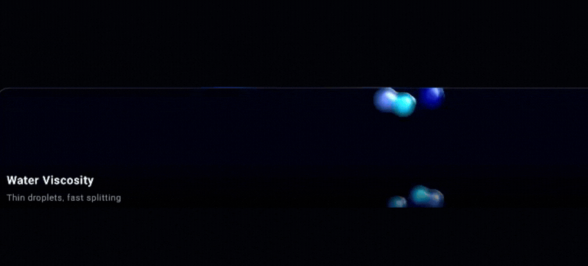
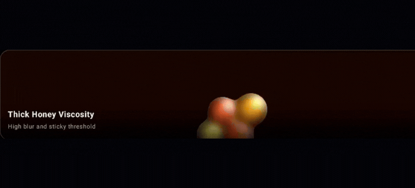
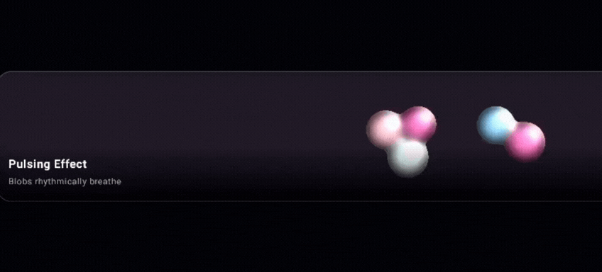
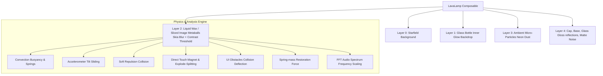

# 🌋 LavaLamp for Jetpack Compose

[](https://developer.android.com)
[](https://developer.android.com)
[](https://github.com/amjad-awad-allah/LavaLampCompose)
[](https://opensource.org/licenses/MIT)

**LavaLamp** is a premium, state-of-the-art viscous fluid physics simulation library designed exclusively for **Jetpack Compose**. It brings beautiful organic fluid metaballs, 3D AGSL refraction shaders, physical obstacle deflection, liquid image warp with spring-based restoration, an audio-reactive visualizer engine, floating micro-particles, and tactile physical feedback to Android with high-performance GPU processing.

---

## 🎬 Feature Showcase & Demos

Welcome to the **LavaLamp Companion App**! The source code includes a fully-featured showcase application (the `app` module) that demonstrates the library's power.

<br>

### 🕹️ Interactive Demos (From Companion App)
Explore the interactive capabilities of the library through these full-screen showcases:

<table align="center">
  <tr>
    <td align="center"><b>Physics Sandbox</b><br></td>
    <td align="center"><b>Splash Screen</b><br></td>
    <td align="center"><b>Background Mode</b><br></td>
  </tr>
</table>

### ✨ Live Physics Examples
A fully tunable physics sandbox to play with viscosity, blobs, flow intensity, and 3D AGSL refraction shaders.
<p align="center">
  
  
  <br>
  
</p>

### 💧 Liquid Image Warp
Slice any image into a viscous fluid! Smear and distort it with touch, and watch the organic spring physics restore it.
<p align="center">
  
</p>

### 🎙️ Audio-Reactive Engine
Transform your microphone input into a living audio visualizer. The metaballs violently scale and glow to the beat while micro-particles drift based on frequency.
<p align="center">
  
</p>

### 🌌 Ambient Modes (Zero & Reverse Gravity)
Invert gravity to simulate Wax Rain, or disable it entirely for a calm Zero-Gravity space drift effect.
<p align="center">
  
  
</p>

---

## 📦 Installation & Versioning

You can integrate this library directly into any Android application using **JitPack** and the GitHub release tag **`2.5.8`**.

### 1. Register JitPack Repository
Add the JitPack maven repository to your root project's `settings.gradle.kts` file:

```kotlin
dependencyResolutionManagement {
    repositoriesMode.set(RepositoriesMode.FAIL_ON_PROJECT_REPOS)
    repositories {
        google()
        mavenCentral()
        maven { url = uri("https://jitpack.io") }
    }
}
```

### 2. Implement Library Dependency
Add the dependency to your app's `build.gradle.kts` file:

```kotlin
dependencies {
    implementation("com.github.amjad-awad-allah:LavaLampCompose:2.5.8")
}
```

---

## ✨ Features

- 🧠 **Advanced Viscous Physics**: Dynamic convection, horizontal drifts, accelerometer-reactive tilt sliding, phone shake emulsification/splitting, and spring-tension neck pinch-off.
- ⚡ **3D AGSL Refraction Shaders**: GPU-accelerated Blinn-Phong lighting, real-time normal estimation from blurred alpha masks, specular highlights, and edge glows (Android 13+). Includes automatic high-performance color matrix fallback for older devices or emulators.
- 🚧 **UI Obstacle Deflection**: Collision deflection around custom bounding boxes. Fluid metaballs dynamically slide, deform, and deflect around active interactive UI cards or buttons.
- 🎨 **Liquid Image Warp & Organic Restoration**: Slice any high-resolution image into a dynamic fluid grid. Swipe to distort, tilt to slosh, and watch it seamlessly morph back to its original single continuous layout via responsive spring-mass physics. Bypasses metaball filters in image mode to preserve crisp, high-fidelity texture details.
- 🎙️ **Audio-Reactive Mode**: Real-time microphone audio processing with FFT spectral analysis. Dynamically splits sound into separate frequency bands (Bass, Mids, Highs) to morph, scale, and glow liquid metaballs to the beat of speech or music.
- ✨ **Ambient Micro-Particles Layer**: Floating glowing neon dust particles that float elegantly through the viscous fluid chamber. They react organically to gravity, convection flow, and touch drag with realistic fluid viscosity physics.
- 🔮 **Elastic Volumetric Repulsion**: Realistic fluid displacement engine where blobs softly push each other aside instead of passing through like ghosts.
- 🧯 **Enterprise-Grade Edge Cases**:
  - **Lifecycle Awareness**: Auto-throttles physics updates when the app goes into the background or gets paused.
  - **Battery Protection**: Auto-unregisters accelerometer sensor listeners and stops audio record listeners when paused.
  - **Memory Safety**: Explicit native recycling of generated noise overlays, bitmap shaders, and audio buffer allocations.
  - **DX Validation**: Fully documented KDoc parameters and robust require-validations prevent layout design issues during development.

---

## 📸 Visual Architecture



---

## 🚀 Quick Start & API Usage

Display a premium interactive Lava Lamp in your Compose layout in just a single line of code:

```kotlin
import androidx.compose.foundation.layout.fillMaxSize
import androidx.compose.runtime.Composable
import androidx.compose.ui.Modifier
import com.example.lavalamp.LavaLamp

@Composable
fun PremiumLavaScreen() {
    // Beautiful default cyberpunk theme with full touch and accelerometer controls
    LavaLamp(modifier = Modifier.fillMaxSize())
}
```

---

## 💡 Popular Use Cases

### 1. Immersive Splash Screen / Loading Screen
Use `LavaLamp` as a captivating full-screen animation while loading data. Place your logo on top using a `Box`:

```kotlin
Box(modifier = Modifier.fillMaxSize(), contentAlignment = Alignment.Center) {
    LavaLamp(
        modifier = Modifier.fillMaxSize(),
        flowIntensity = 0.8f,
        containerMode = LavaContainerMode.AMBIENT_BACKGROUND // No glass bottle
    )
    Image(
        painter = painterResource(id = R.drawable.app_logo),
        contentDescription = "Logo",
        modifier = Modifier.size(120.dp)
    )
}
```

### 2. Live Interactive Background
Give your app a premium "Zen" feel by using it as a slow, soothing background behind login screens or meditation timers:

```kotlin
Box(modifier = Modifier.fillMaxSize()) {
    LavaLamp(
        modifier = Modifier.fillMaxSize(),
        speed = 0.3f,
        flowIntensity = 0.2f,
        containerMode = LavaContainerMode.AMBIENT_BACKGROUND // Pure fluid background
    )
    Column(modifier = Modifier.padding(16.dp)) {
        Text("Welcome Back", color = Color.White)
        // ...
    }
}
```

### 3. Real-Time Audio Visualizer & Particles
Run real-time audio separation (Bass, Mids, Highs) to drive physics scaling and overlay ambient glowing neon dust:

```kotlin
@Composable
fun SoundReactiveVisualizer(
    bass: Float, // 0.0f to 1.0f from FFT
    mids: Float,
    highs: Float
) {
    LavaLamp(
        modifier = Modifier.fillMaxSize(),
        blobCount = 8,
        blobScale = 1.1f + bass * 0.35f, // Grow blobs physically on bass hits
        enableParticles = true,
        particleCount = 60,
        audioInfluence = 1.0f,
        audioFrequencyBands = listOf(bass, mids, highs),
        containerMode = LavaContainerMode.GLASS_BOTTLE
    )
}
```

### 4. Draggable UI Obstacles
Reroute fluid around interactive controls on the fly by supplying layout bounds:

```kotlin
var buttonBounds by remember { mutableStateOf<Rect?>(null) }

Box(modifier = Modifier.fillMaxSize()) {
    LavaLamp(
        modifier = Modifier.fillMaxSize(),
        obstacles = listOfNotNull(buttonBounds)
    )
    Button(
        onClick = { /* ... */ },
        modifier = Modifier
            .align(Alignment.Center)
            .onGloballyPositioned { buttonBounds = it.boundsInParent() }
    ) {
        Text("Bounce Wax!")
    }
}
```

### 5. Interactive Liquid Image Warp
Melt any static image into liquid bubbles on touch, and watch it organically restore back to its original layout:

```kotlin
@Composable
fun InteractiveImageWarp(imageBitmap: ImageBitmap) {
    LavaLamp(
        modifier = Modifier.fillMaxSize(),
        blobCount = 36, // Dynamic 6x6 grid of image slices
        containerMode = LavaContainerMode.AMBIENT_BACKGROUND,
        fluidImage = imageBitmap,
        imageRestorationStrength = 0.04f, // Spring snap-back speed
        enableTiltDeformation = true // Gyroscope tilt sloshes the picture
    )
}
```

---

## 🧩 Comprehensive API Parameters

| Parameter | Type | Default | Description |
| :--- | :--- | :--- | :--- |
| `modifier` | `Modifier` | `Modifier` | Standard layout modifier. |
| `blobCount` | `Int` | `10` | Total number of dynamic liquid metaballs to simulate. Must be $> 0$. |
| `blobScale` | `Float` | `1.0f` | Global scale multiplier for metaballs. Must be $> 0f$. |
| `speed` | `Float` | `1.0f` | Physics simulation speed. Cannot be negative. |
| `flowIntensity` | `Float` | `0.5f` | Fluid buoyancy and convection drift strength. |
| `interactive` | `Boolean` | `true` | When true, touch gestures pull, stretch, and fling fluid. |
| `sensorReactive` | `Boolean` | `true` | Respond to accelerometer tilt sloshing. |
| `noiseOverlay` | `Boolean` | `true` | Premium micro-grain analog matte texture. |
| `lampRotation` | `Float` | `0f` | Rotational tilt offset in degrees for gravity inversion. |
| `gravityMode` | `LavaGravity` | `UP` | Gravity direction: `UP`, `DOWN`, or `ZERO_GRAVITY`. |
| `containerMode` | `LavaContainerMode` | `GLASS_BOTTLE` | `GLASS_BOTTLE` or `AMBIENT_BACKGROUND`. |
| `glassStyle` | `LavaGlassStyle` | `REALISTIC_3D` | Chrome and gloss reflections style: `REALISTIC_3D` or `FLAT_2D`. |
| `viscosity` | `LavaViscosity` | `STANDARD` | Fusion thickness: `WATER`, `STANDARD`, or `THICK_HONEY`. |
| `pulseSpeed` | `Float` | `0f` | Breathing oscillation rate in Hz (0f to disable). |
| `mode` | `LavaMode` | `Vector(CYBERPUNK)` | Vector gradients or custom PNG images as textures. |
| `background` | `LavaBackground` | `StyleBackdrop` | Background color, gradient, or custom overlay textures. |
| `physicsConfig` | `LavaPhysicsConfig` | `default` | Tuning damping, soft repulsion, and touch influence. |
| `shaderConfig` | `LavaShaderConfig` | `default` | Custom 3D refraction, specular highlights, and light vectors. |
| `obstacles` | `List<Rect>` | `emptyList()` | Active Rect bounds that metaballs physically deflect around. |
| `fluidImage` | `ImageBitmap?` | `null` | Target image to liquefy, slice, and warp like fluid. |
| `imageRestorationStrength` | `Float` | `0.05f` | Spring coefficient pulling image slices back to original layout. |
| `enableTiltDeformation` | `Boolean` | `true` | Gyroscope tilt sloshing inside fluid image mode. |
| `audioInfluence` | `Float` | `0f` | Fluid buoyancy scaling multiplier based on audio amplitudes. |
| `audioFrequencyBands` | `List<Float>` | `emptyList()` | Live sound frequency bands (e.g. Bass, Mids, Highs) to scale specific blobs. |
| `enableParticles` | `Boolean` | `false` | Enable or disable the floating micro-particles system. |
| `particleCount` | `Int` | `80` | Total density count of glowing neon particles to render. |

---

## 🧯 Safety & Production Readiness

### 🔋 Battery Protection
Physics simulation calculations pause instantly and gyroscope sensor listeners unregister automatically when the app goes into the background, maintaining zero background battery drain.

### 🎙️ Audio Permission Reliability
The library manifest automatically declares:
```xml
<uses-permission android:name="android.permission.RECORD_AUDIO" />
```
This guarantees proper merging at build time. When using the microphone to capture real-time audio, request the runtime permission safely using your standard activity result launchers. If a permission is denied, the library falls back gracefully to standard convection physics without crashing.

### 🧠 Memory Safety
Cinematic grain textures and dynamically scaled bitmap shader buffers are explicitly recycled on disposal to prevent native garbage collector overhead and memory leaks.

### 🔄 Rotation & Scaling
All layout boundaries, bottle tapers, and collision bounds recalculate dynamically using Compose size-awareness, making it safe for tablets, foldables, and landscape rotation.

---

## 📜 Proguard Rules

If you are using R8/Proguard, add the following line to keep Skia/Compose drawing parameters:

```proguard
-keepclassmembers class androidx.compose.ui.graphics.** { *; }
```

---

## 🗺️ Roadmap

- [x] **Milestone 1: 3D Refraction Shaders (AGSL)** - High-performance normal maps and specular lighting.
- [x] **Milestone 2: Liquid Image Warp** - Slice and warp bitmaps with spring-based restoration.
- [x] **Milestone 3: Audio-Reactive Mode** - Real-time microphone-driven physics and visuals.
- [x] **Milestone 4: Micro-Particles System** - Viscous neon dust particles layered elegantly.
- [ ] **Milestone 5: Compose Multiplatform (KMP) Port** - Bring this viscous liquid physics library to iOS, Desktop, and Web.

---

## 📅 Changelog

### [v2.5.9] - 2026-06-17
- **Performance & Allocation Optimization**: Cached metaball render effect chains, glass path assets, and metallic gradients to prevent garbage collection frame drops.
- **HSV ThreadLocal Optimization**: Added `ThreadLocal` scratch arrays to completely eliminate per-pair `FloatArray` allocations inside the color mixing SPH loop.
- **Lifecycle Privacy Safe**: Automatically pauses audio processor microphone recording and sensor updates when application lifecycle shifts to `ON_PAUSE`, removing background privacy indicators.
- **Audio Thread ANR Prevented**: Prevented background audio thread blocking on thread joins by releasing native `AudioRecord` resources first.
- **SPH & Scale Boundaries**: Rescaled physics SPH loop parameters with `blobScale` to prevent overlapping visual collisions.
- **Bottle Neck Jitter Fixed**: Clamped radius boundary width inputs to prevent bounce jitter/oscillation on large blobs or narrow bottles.
- **Code Clean-up**: Deleted dead file `LavaLampComponent.kt`.

### [v2.5.8] - 2026-06-09
- **Root Stability Fix**: Downgraded all dependencies to stable, production-ready versions.
- **Maximum Compatibility**: Re-aligned versions with SDK 35 and stable Compose BOM.
- **JitPack Deployment**: Optimized for zero-error builds on remote CI environments.

### [v2.5.7] - 2026-06-09
- **Plugin Fix**: Explicitly added missing `kotlin-android` plugin to build files for proper script compilation.
- **Improved Stability**: Fixed `kotlinOptions` unresolved references.

### [v2.5.6] - 2026-06-09
- **Build Fix**: Resolved Kotlin script compilation error in `build.gradle.kts` by migrating to `kotlinOptions`.
- **Compatibility**: Verified builds with Gradle 9.4.1.

### [v2.5.5] - 2026-06-09
- **JVM Upgrade**: Upgraded to **Java 17** (and JVM Target 17) to support modern Gradle environments (Gradle 9.0+).
- **Gradle 9 Compatibility**: Explicitly configured for compatibility with Gradle 9.4.1.

### [v2.5.4] - 2026-06-08
- **Sync Fix**: Minor internal build synchronization adjustments.

### [v2.5.3] - 2026-06-08
- **Compatibility Fix**: Downgraded `compileSdk` and `targetSdk` from 36 to 35 for better compatibility with current stable Android Studio and Gradle environments.
- **AGP Downgrade**: Lowered minimum required Android Gradle Plugin version to 8.7.3 to support developers on stable toolchains.

### [v2.5.1] - 2026-06-07
- **Build Fix**: Fixed a critical Kotlin DSL syntax error in `build.gradle.kts` where single quotes were incorrectly used instead of double quotes for `singleVariant`.
- **JitPack Support**: Formally added the `maven-publish` plugin to ensure reliable artifact generation on JitPack.

### [v2.5.0] - 2026-05-20
- **Audio-Reactive Mode**: Real-time microphone-driven viscous physics. Metamorphoses bubble scale, speed, and white glow shift dynamically to audio amplitudes.
- **Ambient Micro-Particles**: Integrated glowing neon dust layer that reacts to fluid currents, gravity, and touch with viscous drag forces.
- **Liquid Image Warp Polish**: Solved scrambling and overlapping issues. Textures now stitch seamlessly into a single continuous layout at rest and restore smoothly via mass-spring physical calculations.
- **Microphone Permission MERGE**: Added standard `RECORD_AUDIO` declaration in both the library and companion manifests for seamless runtime request integrations.
- **Developer DX & Safety**: Exhaustive KDoc parameters with hover support and require validation checks.

### [v2.0.0] - 2026-05-19
- **SPH Physics**: Replaced Multi-Phase density separation with unified Volumetric SPH Cohesion Physics Engine.
- **LavaContainerMode API**: Added support for full-screen Ambient backgrounds without the bottle container.
- **Gravity Inversion**: Added `lampRotation` API for inverting the fluid flow.
- **Showcase Companion App**: Full interactive project containing 5 unique interactive showcases.

---

## 📬 Developer Contact

- **LinkedIn**: [amjad-awad-allah](https://www.linkedin.com/in/amjad-awad-allah)
- **Email**: amjad.awadallah93@gmail.com
- **Website**: [amjadawadallah.com](https://amjadawadallah.com/)
- **GitHub**: [github.com/amjad-awad-allah](https://github.com/amjad-awad-allah)

---

## 📄 License

MIT License
