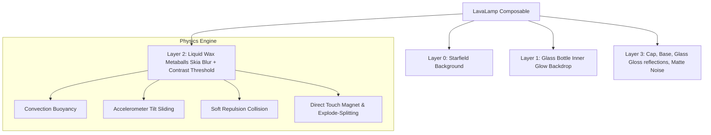

# 🌋 LavaLamp for Jetpack Compose

[](https://developer.android.com)
[](https://developer.android.com/jetpack/compose)
[](https://github.com/amjad-awad-allah/LavaLampCompose)
[](https://opensource.org/licenses/MIT)

**LavaLamp** is a premium, high-fidelity, viscous fluid physics simulation library designed exclusively for **Jetpack Compose**. It brings beautiful organic fluid metaballs, glass tapered chambers, and tactile physics displacement to Android with state-of-the-art GPU optimizations.

---

## 📦 Installation & Versioning

You can integrate this library directly into any Android application using **JitPack** and the GitHub release tag **`1.0.0`**.

### 1. Register JitPack Repository
Add the JitPack maven repository to your root project's `settings.gradle.kts` file:

```kotlin
dependencyResolutionManagement {
    repositoriesMode.set(RepositoriesMode.FAIL_ON_PROJECT_REPOS)
    repositories {
        google()
        mavenCentral()
        maven { url = uri("https://jitpack.io") } // <-- Add this line
    }
}
```

### 2. Implement Library Dependency
Add the dependency to your app's `build.gradle.kts` file:

```kotlin
dependencies {
    // Exact release version for remote JitPack implementation
    implementation("com.github.amjad-awad-allah:LavaLampCompose:1.0.0")
}
```

---

## ✨ Features

- 🧠 **Advanced Viscous Physics**: Dynamic convection, horizontal drifts, accelerometer-reactive tilt sliding, phone shake emulsification/splitting, and tactile pop explosions.
- 🔮 **Elastic Volumetric Repulsion**: Realistic fluid displacement engine where blobs softly push each other aside instead of passing through like ghosts.
- ⚡ **4x GPU Optimization**: Renders continuous real-time Skia Gaussian blurs at a buttery-smooth **60 FPS** on both high-end and budget/low-end devices.
- 🎨 **Ultimate Customizability**: Supports vector gradients, style presets, custom colors, layered backgrounds, and custom PNG images/emojis as wax textures.
- 🧯 **Enterprise-Grade Edge Cases**:
  - **Lifecycle Awareness**: Auto-throttles physics updates when the app goes into the background.
  - **Hardware Battery Protection**: Auto-unregisters accelerometer sensor listeners when paused.
  - **Memory Leak Protection**: Explicit native recycling of generated bitmaps.
  - **Responsive Layouts**: Dynamically fits rotated screens and layout dimensions.

---

## 📸 Visual Architecture



---

## 🚀 Quick Start & API Usage

Here is how easily you can display a premium Lava Lamp in your Compose layout:

```kotlin
import androidx.compose.foundation.layout.fillMaxSize
import androidx.compose.runtime.Composable
import androidx.compose.ui.Modifier
import com.example.lavalamp.LavaLamp
import com.example.lavalamp.LavaMode
import com.example.lavalamp.LavaLampStyle
import com.example.lavalamp.LavaBackground
import com.example.lavalamp.LavaPhysicsConfig

@Composable
fun PremiumLavaScreen() {
    LavaLamp(
        modifier = Modifier.fillMaxSize(),
        blobCount = 6,
        speed = 1.0f,
        flowIntensity = 0.5f,
        mode = LavaMode.Vector(LavaLampStyle.CYBERPUNK),
        background = LavaBackground.StyleBackdrop,
        physicsConfig = LavaPhysicsConfig(
            damping = 0.95f,       // Fluid inertia drag (viscosity)
            softRepulsion = 120f,   // Collision repulsion strength
            smoothingWeight = 0.05f // Interpolation movement smoothing
        )
    )
}
```

---

## 🧩 Comprehensive API Parameters

The `LavaLamp` composable accepts the following configuration parameters:

| Parameter | Type | Default | Description |
| :--- | :--- | :--- | :--- |
| **`modifier`** | `Modifier` | `Modifier` | Layout modifier to control layout sizes. |
| **`blobCount`** | `Int` | `6` | Total count of floating wax bubbles. |
| **`speed`** | `Float` | `1.0f` | Speed factor of the physical clock update loop. |
| **`flowIntensity`**| `Float` | `0.5f` | Convection hot/cold convection fluid strength. |
| **`interactive`** | `Boolean` | `true` | Enables touch-to-attract and touch-to-pop actions. |
| **`sensorReactive`**| `Boolean` | `true` | Enables tilt sliding (gravity) and vigorous phone-shake bubble splitting. |
| **`noiseOverlay`** | `Boolean` | `true` | Renders a tactile cinema matte-finish noise layer. |
| **`mode`** | `LavaMode` | `Vector(CYBERPUNK)`| Blob rendering: `Vector` (gradients) or `Png` (custom images/emojis). |
| **`background`** | `LavaBackground`| `StyleBackdrop` | Backdrops: `StyleBackdrop`, `Transparent`, or `Custom(chamberBg, wholeBg)`. |
| **`physicsConfig`**| `LavaPhysicsConfig`| `LavaPhysicsConfig()`| Custom viscous tuning parameter wrapper. |

---

## 🎨 Custom PNG Images Mode (Metaballs Blending)

To blend custom PNG assets or emojis as liquid blobs inside the glass chamber:

```kotlin
val emojiBitmaps = remember {
    listOf(
        createEmojiBitmap("💜", 160),
        createEmojiBitmap("👾", 160),
        createEmojiBitmap("🦄", 160)
    )
}

LavaLamp(
    blobCount = 8,
    mode = LavaMode.Png(images = emojiBitmaps)
)
```

---

## 🧯 Edge Cases & Production Readiness

### 1. 🔋 Zero Battery Drain in Background
When your app is paused (screen locked or in background), the library:
- **Freezes Physics Math**: Skips calculation updates entirely.
- **Unregisters Accelerometer Sensor**: Instantly releases system sensors via lifecycle observers, avoiding background permission warnings.

### 2. 🧠 No Memory Leaks (AAR Safe)
Generated bitmaps (such as the cinema noise overlay) are explicitly recycled when the Composable disposes to keep memory overhead at exactly **0%** when closed.

### 3. 🔄 Robust Screen Rotations
All glass paths and boundary limits are calculated using dynamic Compose dimensions (`onSizeChanged`). Rotating your device from portrait to landscape maintains perfect tapered boundaries with zero stretching.

---

## 📜 Proguard Rules

If you are minifying your release build, keep Compose graphics layers safe by adding this to your `proguard-rules.pro`:

```proguard
# Keep compose graphics render effects safe
-keepclassmembers class androidx.compose.ui.graphics.** { *; }
```

---

## 📅 Changelog

### [v1.0.0] - 2026-05-18
- **Initial Stable Release** 🌋
- Independent `:lavalamp` library module architecture.
- Volumetric soft collision push physics engine.
- 4x rendering speed blur performance tuning (60fps guaranteed).
- Dynamic sensor registration and lifecycle pause/resume safety.
- Native allocated bitmap memory auto-recycling.


---

## 📬 Contact
- **LinkedIn**: [amjad-awad-allah](https://www.linkedin.com/in/amjad-awad-allah)
- **Email**: [amjad.awadallah93@gmail.com](mailto:amjad.awadallah93@gmail.com)
- **Webseit**:  [amjadawadallah.com](https://amjadawadallah.com/)
- **GitHub**: [@amjad-awad-allah](https://github.com/amjad-awad-allah)


## 📄 License

This library is licensed under the **MIT License**. Build, package, customize, and monetize! 🌋
