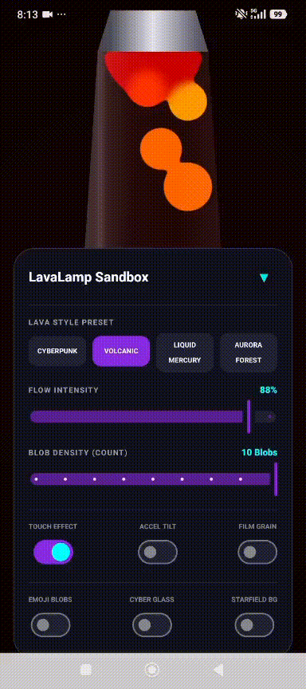
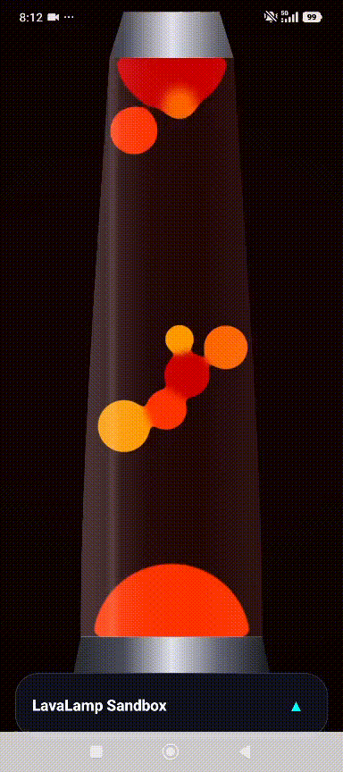
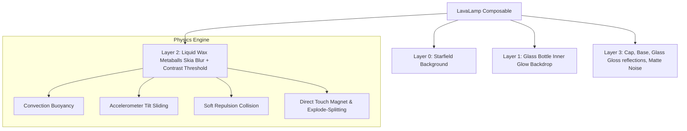

# 🌋 LavaLamp for Jetpack Compose

[](https://developer.android.com)
[](https://developer.android.com/jetpack/compose)
[](https://github.com/amjad-awad-allah/LavaLampCompose)
[](https://opensource.org/licenses/MIT)

**LavaLamp** is a premium, high-fidelity, viscous fluid physics simulation library designed exclusively for **Jetpack Compose**. It brings beautiful organic fluid metaballs, glass tapered chambers, and tactile physics displacement to Android with state-of-the-art GPU optimizations.

---

## 🎬 Demo Preview

<p align="center">
  
  
  
</p>

---

## 📦 Installation & Versioning

You can integrate this library directly into any Android application using **JitPack** and the GitHub release tag **`1.0.0`**.

### 1. Register JitPack Repository
Add the JitPack maven repository to your root project's `settings.gradle.kts` file:

```kotlin
dependencyResolutionManagement {
    repositoriesMode.set(RepositoriesMode.FAIL_ON_PROJECT_REPOS)
    repositories {
        google()
        mavenCentral()
        maven { url = uri("https://jitpack.io") }
    }
}
```

### 2. Implement Library Dependency
Add the dependency to your app's `build.gradle.kts` file:

```kotlin
dependencies {
    implementation("com.github.amjad-awad-allah:LavaLampCompose:1.0.0")
}
```

---

## ✨ Features

- 🧠 **Advanced Viscous Physics**: Dynamic convection, horizontal drifts, accelerometer-reactive tilt sliding, phone shake emulsification/splitting, and tactile pop explosions.
- 🔮 **Elastic Volumetric Repulsion**: Realistic fluid displacement engine where blobs softly push each other aside instead of passing through like ghosts.
- ⚡ **4x GPU Optimization**: Renders continuous real-time Skia Gaussian blurs at a buttery-smooth **60 FPS** on both high-end and budget/low-end devices.
- 🎨 **Ultimate Customizability**: Supports vector gradients, style presets, custom colors, layered backgrounds, and custom PNG images/emojis as wax textures.
- 🧯 **Enterprise-Grade Edge Cases**:
  - Lifecycle Awareness: Auto-throttles physics updates when the app goes into the background.
  - Hardware Battery Protection: Auto-unregisters accelerometer sensor listeners when paused.
  - Memory Leak Protection: Explicit native recycling of generated bitmaps.
  - Responsive Layouts: Dynamically fits rotated screens and layout dimensions.

---

## 📸 Visual Architecture



---

## 🚀 Quick Start & API Usage

Here is how easily you can display a premium Lava Lamp in your Compose layout:

```kotlin
import androidx.compose.foundation.layout.fillMaxSize
import androidx.compose.runtime.Composable
import androidx.compose.ui.Modifier
import com.example.lavalamp.LavaLamp
import com.example.lavalamp.LavaMode
import com.example.lavalamp.LavaLampStyle
import com.example.lavalamp.LavaBackground
import com.example.lavalamp.LavaPhysicsConfig

@Composable
fun PremiumLavaScreen() {
    LavaLamp(
        modifier = Modifier.fillMaxSize(),
        blobCount = 6,
        speed = 1.0f,
        flowIntensity = 0.5f,
        mode = LavaMode.Vector(LavaLampStyle.CYBERPUNK),
        background = LavaBackground.StyleBackdrop,
        physicsConfig = LavaPhysicsConfig(
            damping = 0.95f,
            softRepulsion = 120f,
            smoothingWeight = 0.05f
        )
    )
}
```

---

## 🧩 Comprehensive API Parameters

| Parameter | Type | Default | Description |
| :--- | :--- | :--- | :--- |
| modifier | Modifier | Modifier | Layout modifier |
| blobCount | Int | 6 | Number of blobs |
| speed | Float | 1.0f | Animation speed |
| flowIntensity | Float | 0.5f | Fluid flow strength |
| interactive | Boolean | true | Touch interaction |
| sensorReactive | Boolean | true | Motion sensor support |
| noiseOverlay | Boolean | true | Film grain effect |
| mode | LavaMode | Vector(CYBERPUNK) | Rendering mode |
| background | LavaBackground | StyleBackdrop | Background style |
| physicsConfig | LavaPhysicsConfig | default | Physics tuning |

---

## 🎨 Custom PNG Images Mode

```kotlin
val emojiBitmaps = remember {
    listOf(
        createEmojiBitmap("💜", 160),
        createEmojiBitmap("👾", 160),
        createEmojiBitmap("🦄", 160)
    )
}

LavaLamp(
    blobCount = 8,
    mode = LavaMode.Png(images = emojiBitmaps)
)
```

---

## 🧯 Edge Cases & Production Readiness

### 🔋 Background Safety
Physics pauses automatically and sensors are unregistered.

### 🧠 Memory Safety
Bitmaps are recycled on dispose to prevent leaks.

### 🔄 Rotation Handling
All layouts adapt dynamically using Compose size awareness.

---

## 📜 Proguard Rules

```proguard
-keepclassmembers class androidx.compose.ui.graphics.** { *; }
```

---

## 📅 Changelog

### [v1.0.0] - 2026-05-18
- Initial stable release
- Fluid physics engine
- GPU blur optimization
- Sensor integration
- Memory safety layer

---

## 📬 Contact

- LinkedIn: https://www.linkedin.com/in/amjad-awad-allah
- Email: amjad.awadallah93@gmail.com
- Website: https://amjadawadallah.com/
- GitHub: https://github.com/amjad-awad-allah

---

## 📄 License

MIT License
